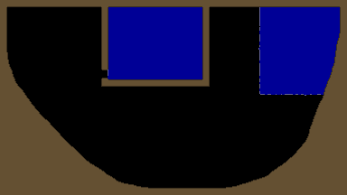

# Poor Man's Liquid

A grid-based liquid simulation. There are no particles.

Left-click to add liquid and right-click to remove liquid.
While holding `shift`, left-click to add solid and right-click to remove solid.
Press `1` though `7` to change the scene.

